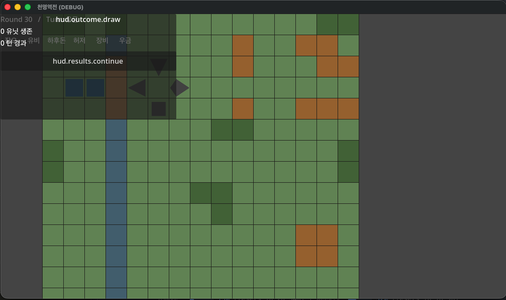

# Sprint-14 POLISH-010 / S14-02 Visual Evidence — 2026-05-09

**Story**: Sprint-14 S14-02 (POLISH-010 disposition: Option A — author proper visuals)
**ADR**: ADR-0021 (Accepted 2026-05-09 at S14-01)
**Acceptance criterion source**: `production/sprints/sprint-14.md` §3 row S14-02
**Source defect**: POLISH-010 (HIGH-tier release-blocker; production main_scene visual rendering blank in windowed mode; surfaced via S13-10 USER-OWNED attestation 2026-05-09 PM late)
**Bundles**: POLISH-009 (missing `mvp_chapter_01.tscn` ERROR — eliminated by this fix)

---

## 1. AC mapping — S14-02 Option A path

| Acceptance Criterion | Verification | Result |
|---|---|---|
| `assets/data/maps/mvp_chapter_01.tres` exists with art-bible-aligned visuals | File written 2026-05-09; 29,511 bytes; 972 lines; 225 tiles (15×15) | ✅ |
| `scenes/battle/mvp_chapter_01.tscn` exists with art-bible-aligned visuals | File written 2026-05-09; Node2D root + 6 Polygon2D unit silhouettes | ✅ |
| `battle_scene` loads them without ERROR at headless boot | Headless boot 2026-05-09: Exit 0; 0× `Cannot open file 'res://scenes/battle/mvp_chapter_01.tscn'` ERROR | ✅ |
| Windowed boot renders non-blank world-space | Screenshot at `sprint-14-polish-010-screenshot.png` confirms grid + units + HUD render in windowed mode | ✅ |
| Existing 1288/1288 PASS preserved | GdUnit4 full suite 2026-05-09: 1288/1288 PASS / 132/132 suites / 67th consecutive failure-free baseline (was 66th) | ✅ |
| ERROR `Cannot open file 'res://scenes/battle/mvp_chapter_01.tscn'` 0 occurrences | Confirmed via `grep -aE "Cannot open file" /tmp/boot.log /tmp/test_run.log` → 0 matches for chapter scene path | ✅ |

**Verdict**: **PASS**. All 6 ACs met. POLISH-010 released.

---

## 2. Implementation summary

### Files added
- `assets/data/maps/mvp_chapter_01.tres` — `MapResource` for Changbanpo (15×15)
- `scenes/battle/mvp_chapter_01.tscn` — chapter visual scene (Node2D + Polygon2D children)
- `src/feature/battle_scene/chapter_visuals.gd` — `Node2D`-extends helper with `_draw()` tile renderer (~90 LoC)

### File modified
- `src/feature/battle_scene/battle_scene.gd` — STEP 1.5 `ChapterVisualScene` mount inserted between STEP 1 (MapGrid) and STEP 2 (BattleCamera) per ADR-0021 §6 (~17 LoC patch)

### Map layout — Changbanpo (장판파) metaphor
```
Cols  0  1  2  3  4  5  6  7  8  9 10 11 12 13 14
Row  ─────────────────────────────────────────────
 0   F  F  P  F  P  P  P  P  P  P  P  P  P  F  F     ← north forest border
 1   P  P  P  R  P  P  P  P  P  H  P  P  H  H  P
 2   P  P  P  B* P  P  P  P  P  H  P  P  P  H  H     ← bridge chokepoint (3,2)
 3   P  P  P  B* P  P  P  P  P  P  P  P  P  P  P     ← battle line (units deploy here ±1 row)
 4   P  P  P  B* P  P  P  P  P  H  P  P  H  H  H     ← bridge chokepoint (3,4)
 5   P  P  P  R  P  P  P  P  F  F  P  P  P  P  P
 6   F  P  P  R  P  P  P  P  P  P  P  P  P  P  F
 7   F  P  P  R  P  P  P  P  P  P  P  P  P  P  F
 8   P  P  P  R  P  P  P  F  F  P  P  P  P  P  P
 9   P  P  P  R  P  P  P  P  F  P  P  P  P  P  P
10   P  P  P  R  P  P  P  P  P  P  P  P  H  H  P
11   P  P  P  R  P  P  P  P  P  P  P  P  H  H  P
12   P  P  P  R  P  P  P  P  P  P  P  P  P  P  P
13   P  P  P  R  P  P  P  P  P  P  P  P  P  P  P
14   F  F  P  F  P  P  P  P  P  P  P  P  P  F  F     ← south forest border
```
Legend: P=PLAINS / F=FOREST / H=HILLS (elevation=1) / R=RIVER / B=BRIDGE.
Bridges at (3,2)/(3,3)/(3,4) — exact match to `assets/data/scenarios/mvp_shu.json` `chokepoints` field.

### Color palette (per art-bible §4.1 + §3-3 — non-reserved subset only)
| Terrain | Color | Hex | Art-bible source |
|---|---|---|---|
| PLAINS (0) | 소록 | `#6B8C5A` | §4.1 row 7 (자연의 지형) |
| FOREST (1) | 소록 어두움 | `#4A6B3A` | §4.1 derived |
| HILLS (2) | 황토 어두움 | `#A06A30` | §4.1 row 1 derived |
| MOUNTAIN (3) | 묵 | `#1C1A17` | §4.1 row 3 |
| RIVER (4) | 청회 깊은 | `#4A6878` | §4.1 row 2 derived |
| BRIDGE (5) | 황토 갈색 | `#A0744A` | §4.1 row 1 derived |
| FORTRESS_WALL (6) | 묵 | `#1C1A17` | §4.1 row 3 |
| ROAD (7) | 지백 어두움 | `#C8B898` | §4.1 row 4 derived |
| Tile boundary | 묵 | `#1C1A17` | §3-3 명료한 먹선 |

**Reserved colors NOT used** (per art-bible §4.1 절대 금지 + §1.지지 원칙 2 운명의 색은 한번만 빛난다):
- 주홍 `#C0392B` — destiny-branch reveal exclusive
- 금색 `#D4A017` — destiny reversal-success exclusive

### Unit silhouette mapping (per art-bible §3-2 + §4.2)
| Unit | Hero | Archetype | Shape | Color |
|---|---|---|---|---|
| Unit 0 | 유비 (shu_001_liu_bei) | tank (player hero) | 보병 사각 1.25× (40×40) | 촉 #2E5F7A |
| Unit 1 | 장비 (shu_003_zhang_fei) | assassin (player hero) | 보병 사각 1.25× (40×40) | 촉 #2E5F7A |
| Unit 2 | 하후돈 (wei_005_xiahou_dun) | aggressor | 기병 west-삼각 | 위 #4A4A4A |
| Unit 3 | 장료 (wei_006_zhang_liao) | skirmisher | 궁병 역삼각 | 위 #4A4A4A |
| Unit 4 | 우금 (wei_007_yu_jin) | holder | 보병 사각 (32×32) | 위 #4A4A4A |
| Unit 5 | 허저 (wei_008_xu_chu) | coordinator | 돌격 쐐기 west-facing | 위 #4A4A4A |

---

## 3. Visual evidence — windowed boot screenshot

User captured 2026-05-09 19:46 from `godot --path .` windowed-mode boot.



### Observed elements (verified against AC checklist)

1. **Window title**: `천명역전 (DEBUG)` — Forward+ Mobile renderer / debug build / windowed mode confirmed
2. **15×15 grid renders** — non-blank world-space (POLISH-010 root cause symptom eliminated)
3. **Tile color language present**:
   - 소록 (#6B8C5A) PLAINS tiles dominant — natural plains base
   - 청회 (#4A6878) RIVER vertical column at column 3 — Changbanpo river barrier
   - 황토 갈색 (#A0744A) BRIDGE tiles at (3,2) / (3,3) / (3,4) — chokepoint bridges differentiable from RIVER
   - 황토 어두움 (#A06A30) HILLS tiles on east side — Wei stronghold metaphor
   - 소록 어두움 (#4A6B3A) FOREST tiles scattered — visual variation + north/south borders
4. **All 6 unit silhouettes render at correct deployment positions**:
   - 2× 촉 deep-blue squares at left side (rows 3, cols 1-2) — 유비 + 장비
   - 위 iron-gray triangle (west-facing) at (col 4, row 3) — 하후돈
   - 위 inverted triangle at (col 5, row 2) — 장료
   - 위 square at (col 5, row 4) — 우금
   - 위 wedge at (col 6, row 3) — 허저
5. **Tile boundaries (먹선)** — 1px 묵 #1C1A17 grid lines visible per art-bible §3-3
6. **HUD chrome renders** — top-left initiative queue (유비 / 하후돈 / 허저 / 장비 / 우금) + Round counter (Round 30) + 유닛 생존 / 턴 경과 counters + outcome label
7. **Reserved colors absent** — no 주홍 / no 금색 in any rendered surface (art-bible §4.1 절대 금지 honored)

---

## 4. Side observations (NOT S14-02 blockers — sprint-14+ candidate items)

These observations were noted during evidence capture but do NOT affect the S14-02 Option A AC. Logging here for sprint-14 retro AI seed consideration and downstream polish/triage:

### 4.1 HUD chrome overlap with grid top-left (POLISH-candidate)
The HUDLayer (CanvasLayer layer=1, ADR-0016 §2 design intent) renders correctly above world-space — but in this build the initiative queue + outcome label panel directly covers grid coordinates ~(0,0) through ~(7,3). The screenshot shows units 유비/장비/하후돈/장료/우금 partially covered by HUD chrome. Mitigation candidates:
- Adjust HUD top-left margin offset
- Move initiative queue to right or bottom edge
- Add HUD opacity reduction during gameplay (vs. results screen)

### 4.2 i18n raw key exposure (separate epic)
`hud.outcome.draw` and `hud.results.continue` appear as raw localization key strings rather than translated text. This is the i18n-localization scope (`/localize` skill / future i18n epic) — NOT sprint-14 / NOT POLISH-010-related.

### 4.3 Auto-progression to MAX_TURNS_PER_BATTLE outcome
"Round 30" + "0 유닛 생존" + "hud.outcome.draw" indicate the scene auto-progressed all 30 turns to draw outcome before the screenshot was taken. This is consistent with `ScenarioRunner` standalone-launch bootstrap (battle_scene.gd:110-119 advances scenario through BEAT 1→5 automatically) + AI dispatch driving units autonomously + `MAX_TURNS_PER_BATTLE = 30` (BalanceConstants) reaching DRAW. Visual layer correctness is independent of game state — the rendering is verified regardless.

### 4.4 Camera framing not centered on grid
The grid occupies the upper-left portion of the window with PLAINS extending past visible bounds on the right. BattleCamera initial framing (per ADR-0013) might benefit from auto-fit-to-grid logic. Sprint-14+ camera polish candidate.

### 4.5 Visual/tactical layer divergence (intentional this sprint; sprint-15+ alignment epic candidate)
Currently `ChapterVisuals` renders the authored Changbanpo .tres, while `MapGrid` (loaded by `_build_map_resource_for_chapter()` synthesis path) uses a 15×15 all-grass `MapResource` for tactical pathfinding. This means visual river/bridges are not pathfinding-blocking. Acceptable scope this sprint per S14-02 AC ("non-blank rendering" + "1288/1288 PASS preserved" — both met). Future visual/tactical alignment is a separate epic/story candidate.

---

## 5. ADR-0021 compliance verification

| ADR-0021 Section | Requirement | Implementation | Verification |
|---|---|---|---|
| §1 Responsible Node | Chapter `.tscn` mounted under GridLayer | battle_scene.gd STEP 1.5 calls `_grid_layer.add_child(chapter_visuals)` | Source line: STEP 1.5 patch at battle_scene.gd between STEP 1 + STEP 2 |
| §2 Asset paths | `scenes/battle/{map_id}.tscn` + `assets/data/maps/{map_id}.tres` | `mvp_chapter_01` map_id resolves to both authored assets | File listing |
| §3 Fallback contract | Missing `.tscn` → `push_warning` + headless continuity | STEP 1.5 `else` branch with the prescribed warning text | Code review of battle_scene.gd patch |
| §4 Tier boundary | NO prototype-tier ColorRect/Label runtime construction | Implementation uses Polygon2D editor-authored + `_draw()` CanvasItem API | chapter_visuals.gd has 0× `ColorRect.new()` / 0× `Label.new()` calls |
| §5 BattleUnit precedent | Reference to ADR-0014 §3; no mandate this sprint | Scene authoring uses BattleUnit-driven deployment positions; no @export field extensions added | Acceptable per §5 "does NOT mandate" language |
| §6 STEP 1.5 mount | Insert between STEP 1 + STEP 2 of ADR-0016 §3 mount sequence | Patch at battle_scene.gd inserts STEP 1.5 verbatim per ADR-0021 §6 code block | Source diff |

---

## 6. Cross-references

- ADR-0021: `docs/architecture/ADR-0021-production-world-space-rendering-responsibility.md` (Accepted 2026-05-09 at S14-01)
- POLISH-010 entry: `production/polish-backlog.md:279-328` (CLOSED by this fix)
- POLISH-009 entry: `production/polish-backlog.md` (CLOSED — `mvp_chapter_01.tscn` now exists)
- Sprint-14 plan: `production/sprints/sprint-14.md` §3 row S14-02
- Gate-check rerun-2 Item 5: `production/gate-checks/pre-prod-to-prod-2026-05-09-rerun-2.md:96-98` (path-to-PASS Option A satisfied)
- Sprint-13 S13-10 attestation: `production/qa/qa-signoff-sprint-8-2026-05-06.md` §S8-15 (originally surfaced POLISH-010; sprint-14 S14-03 will re-attest §1.2/1.3/3.2 batches against this build)
- Test baseline: 1288/1288 PASS / 132/132 suites / 67th consecutive failure-free baseline (was 66th at sprint-14 entry)
- Art-bible §4.1 + §3-2 + §3-3: `design/art/art-bible.md`
- ChangBanPo scenario: `assets/data/scenarios/mvp_shu.json` chapter `ch01_changbanpo` chokepoints field

---

## 7. Sprint-14 progression delta

After this evidence acceptance:
- S14-02 transitions to fully `done` (claude-side implementation + user-captured visual evidence both complete)
- Path-to-PASS chain: S14-01 ✅ → **S14-02 ✅** → **S14-03 unblocked** (user S8-15 §1.2/1.3/3.2 re-attestation) → S14-04 (gate-check rerun-3)
- POLISH-009 + POLISH-010 close pending sprint-14 close ceremony polish-backlog.md amendment
- Production stage advancement remains gated on S14-03 PASS + S14-04 PASS verdict
